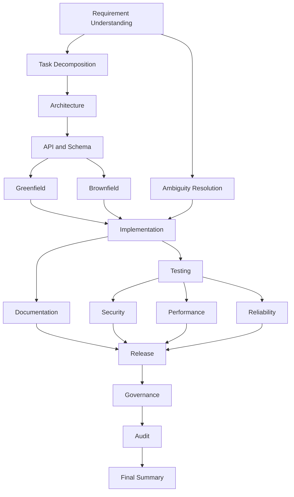

# Architecture Overview

## System components

### Backend

- `UrlShortenerController`: exposes product APIs for creating, listing, redirecting, deactivating, and analyzing short URLs.
- `UrlShortenerService`: validates requests, manages alias allocation, tracks access events, and persists URL state.
- `WorkflowController`: exposes orchestration APIs for workflow lifecycle actions.
- `WorkflowService`: executes the SDLC DAG, persists state snapshots, tracks decisions and risks, enforces approvals, retries, fallback, rollback, and safe-stop behavior.
- `ApplicationProperties`: centralizes runtime paths and retry settings.

### Frontend

- Angular standalone dashboard that exercises the product API and the orchestration API from one screen.

## Product architecture

```mermaid
flowchart LR
    UI[Angular Dashboard] --> URLAPI[URL API]
    URLAPI --> URLService[UrlShortenerService]
    URLService --> URLStore[(runtime/url-records.json)]
    Browser[Redirect Client] --> Redirect[/r/{code}/]
    Redirect --> URLService
```

## Orchestration architecture



## Governance model

- Approval gates pause execution for architecture, schema, brownfield analysis, security, release, and governance nodes.
- Approval decisions are stored with approver, timestamp, and notes.
- Unsafe requirement content triggers safe-stop before release progression.
- All workflow transitions are recorded in the workflow state file.

## Reliability model

- Retries are bounded by `app.max-retries`.
- A simulated transient failure path demonstrates retry handling.
- Retry exhaustion triggers reduced-scope fallback and emits a decision record.
- Rollback restores the previous persisted snapshot and marks nodes as rolled back.

## Persistence model

- Product records are stored in `runtime/url-records.json`.
- Workflow states are stored in `runtime/workflows/{workflowId}.json`.
- The persisted state includes approvals, risks, decisions, snapshots, transitions, metrics, and artifact references.

## Observability model

The workflow state tracks:

- workflow success rate
- agent success rate
- total retries
- rollback count
- fallback count
- MTTR proxy
- average task duration
- workflow duration
- approval wait time
- validation latency
- end-to-end latency

## Key trade-offs

- File-backed persistence keeps the assignment runnable without external infrastructure.
- The orchestration engine runs in-process, which simplifies demoability but is not horizontally scalable.
- Human approvals are modeled explicitly in state and API flows, but not yet integrated with identity or notifications.